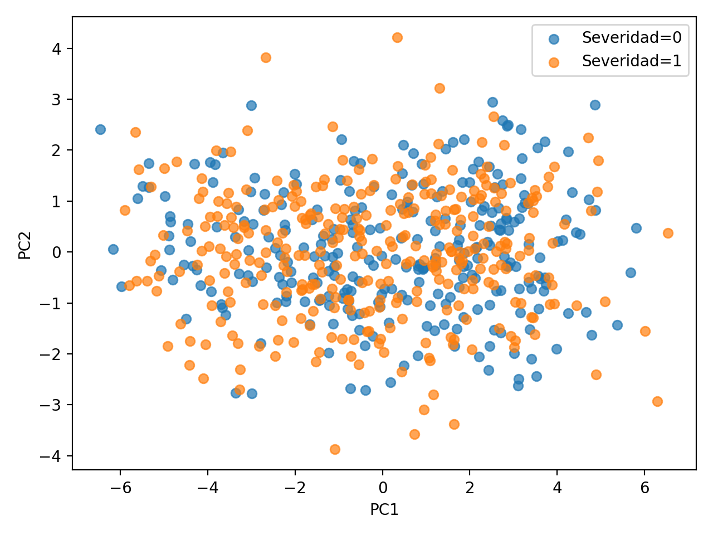
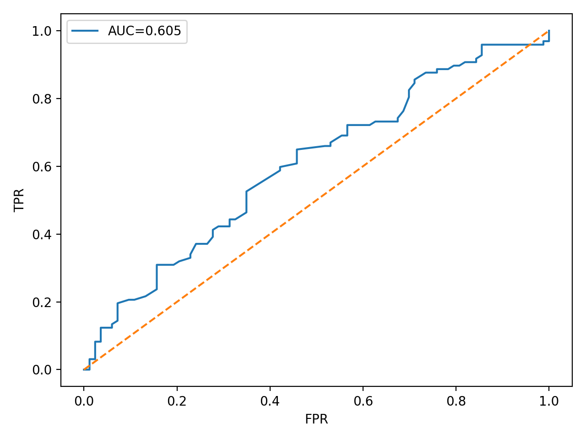

[README_GITHUB_EXTENDIDO.md](https://github.com/user-attachments/files/24259880/README_GITHUB_EXTENDIDO.md)

# Fenotipado y Predicción de Severidad en Datos de Alta Dimensionalidad

## Contexto Epidemiológico
En el contexto de un hospital que trata un **Síndrome Crónico complejo**, se reconoce que los pacientes no constituyen un grupo homogéneo. 
Diversos factores biológicos, clínicos y sociales pueden generar **subgrupos de pacientes (fenotipos)** con distinta evolución clínica y respuesta a la terapia.

Desde la perspectiva de la Bioestadística y la Epidemiología Clínica, surge la necesidad de:
1. **Identificar estos fenotipos** mediante técnicas no supervisadas.
2. **Predecir tempranamente la severidad** de la enfermedad para apoyar decisiones de intervención.

Este proyecto integra conceptos de **validación de modelos, aprendizaje no supervisado y modelos complejos**, abordando el problema desde un enfoque moderno de Machine Learning aplicado a salud.

---

## Objetivo del Proyecto
- Simular un dataset clínico de alta dimensionalidad.
- Descubrir fenotipos clínicos mediante reducción de dimensionalidad y clustering.
- Integrar los fenotipos como variables predictivas.
- Evaluar un modelo supervisado para la predicción de severidad.

---

## Preparación del Dataset

El dataset fue generado de manera sintética con el objetivo de reproducir condiciones realistas observadas en datos clínicos.

Características principales:
- **600 pacientes simulados**
- **15 variables continuas** que representan biomarcadores y síntomas.
- **Outcome binario:** `Severidad`
  - 0 = Baja severidad
  - 1 = Alta severidad

La simulación incorpora estructura latente, permitiendo que el proceso de fenotipado tenga significado clínico y no sea puramente aleatorio.

El dataset final se exporta como:
- `synthetic_fenotypes_dataset.csv`

---

## Preparación de los Datos

### Escalado de Variables
Antes de aplicar cualquier técnica de reducción de dimensionalidad o clustering, las variables fueron **escaladas con StandardScaler**.

Justificación:
- PCA depende de la varianza de las variables.
- KMeans se basa en distancias euclidianas.
- Las redes neuronales (MLP) requieren escalado para estabilidad numérica.

```python
from sklearn.preprocessing import StandardScaler

scaler = StandardScaler()
X_scaled = scaler.fit_transform(X)
```

---

### Reducción de Dimensionalidad: PCA
Se aplicó **Análisis de Componentes Principales (PCA)** para reducir las 15 variables originales a 2 componentes, con el fin de **explorar la estructura de los datos**.

```python
from sklearn.decomposition import PCA

pca = PCA(n_components=2, random_state=42)
X_pca = pca.fit_transform(X_scaled)

print("Varianza explicada PC1 + PC2:", pca.explained_variance_ratio_.sum())
```

**Resultado obtenido:**  
Los dos primeros componentes principales explican aproximadamente **58.5% de la varianza total**.

Interpretación:
- Este porcentaje indica que una proporción importante de la información original se conserva.
- Sin embargo, también evidencia que el fenómeno es complejo y no completamente representable en dos dimensiones.

---

# Fenotipado No Supervisado

## Visualización PCA según Severidad
La primera visualización corresponde a la proyección **PC1 vs PC2**, coloreada según el outcome real de severidad.

```python
import matplotlib.pyplot as plt

plt.figure()
for s in [0, 1]:
    mask = y.values == s
    plt.scatter(X_pca[mask, 0], X_pca[mask, 1], alpha=0.7, label=f"Severidad={s}")
plt.xlabel("PC1")
plt.ylabel("PC2")
plt.legend()
plt.title("PCA según Severidad")
plt.show()
```



**Interpretación clínica:**  
Aunque PCA no utiliza la severidad para construir los componentes, se observa una **separación parcial** entre pacientes con severidad alta y baja. 
Esto sugiere que existen patrones latentes en los biomarcadores que se asocian con el desenlace clínico, reforzando la hipótesis de heterogeneidad del síndrome.

---

## Clustering con K-Means: Identificación de Fenotipos
Para identificar subgrupos clínicos se aplicó **KMeans con k = 3** sobre los datos escalados.

```python
from sklearn.cluster import KMeans

kmeans = KMeans(n_clusters=3, random_state=42, n_init="auto")
df["Fenotipo"] = kmeans.fit_predict(X_scaled)
```

**Distribución observada de fenotipos:**
- Fenotipo 0: 209 pacientes
- Fenotipo 1: 233 pacientes
- Fenotipo 2: 158 pacientes

**Interpretación:**  
La presencia de tres fenotipos confirma que el síndrome no es homogéneo. 
Desde el punto de vista de la investigación clínica, esto implica que:
- Los pacientes podrían responder de manera diferente a una misma intervención.
- Los ensayos clínicos deberían considerar estratificación por fenotipo.
- Se reduce el riesgo de conclusiones erróneas basadas en promedios poblacionales.

---

# Modelado Supervisado

## Integración del Fenotipo como Variable Predictiva
El fenotipo identificado se incorpora explícitamente como predictor, combinando información no supervisada con un modelo supervisado.

```python
from sklearn.model_selection import train_test_split

X_model = df[features + ["Fenotipo"]]

X_train, X_test, y_train, y_test = train_test_split(
    X_model, y,
    test_size=0.30,
    stratify=y,
    random_state=42
)
```

Esta estrategia permite evaluar si el conocimiento del subgrupo clínico mejora la predicción del outcome.

---

## Modelo de Ensamble: Random Forest
Se entrenó un **RandomForestClassifier**, adecuado para datos tabulares clínicos por su capacidad de modelar relaciones no lineales y manejar interacciones complejas.

```python
from sklearn.compose import ColumnTransformer
from sklearn.pipeline import Pipeline
from sklearn.preprocessing import StandardScaler, OneHotEncoder
from sklearn.ensemble import RandomForestClassifier

preprocessor = ColumnTransformer(
    transformers=[
        ("num", StandardScaler(), features),
        ("cat", OneHotEncoder(handle_unknown="ignore"), ["Fenotipo"])
    ]
)

rf = RandomForestClassifier(
    n_estimators=300,
    class_weight="balanced",
    random_state=42
)

model = Pipeline(steps=[
    ("prep", preprocessor),
    ("rf", rf)
])

model.fit(X_train, y_train)
```

---

## Evaluación del Modelo
El desempeño del modelo se evaluó mediante el **Área Bajo la Curva ROC (AUC)**.

```python
from sklearn.metrics import roc_auc_score, roc_curve
import matplotlib.pyplot as plt

y_proba = model.predict_proba(X_test)[:, 1]
auc = roc_auc_score(y_test, y_proba)

fpr, tpr, _ = roc_curve(y_test, y_proba)

plt.figure()
plt.plot(fpr, tpr, label=f"AUC={auc:.3f}")
plt.plot([0,1], [0,1], linestyle="--")
plt.xlabel("False Positive Rate")
plt.ylabel("True Positive Rate")
plt.title("Curva ROC - Random Forest")
plt.legend()
plt.show()
```



**Resultado obtenido:**  
AUC en el conjunto de prueba ≈ **0.60**.

**Interpretación:**  
El modelo presenta una capacidad moderada de discriminación. 
En un escenario real, este resultado justificaría:
- Ajustes de hiperparámetros.
- Comparación con otros modelos (MLP, XGBoost).
- Evaluación adicional de calibración y validación externa.

---

# Reflexión Crítica

## Interpretación del Fenotipado
El PCA muestra que dos componentes explican cerca del 58.5% de la varianza, lo cual es razonable en datos clínicos complejos. 
La identificación de tres fenotipos sugiere subgrupos clínicamente relevantes, fundamentales para el diseño de ensayos y estrategias terapéuticas personalizadas.

---

## Rol del MLP (Redes Neuronales)
Aunque el Random Forest es adecuado para este escenario tabular, un bioestadístico consideraría redes neuronales cuando:
- Existen datos no tabulares (imágenes, texto clínico, señales).
- Se dispone de grandes volúmenes de datos.
- Se requiere aprender representaciones complejas.

El escalado previo de variables es crítico para el entrenamiento estable de estos modelos.

---

## Desafío Ético y Sesgo Algorítmico
Si una variable se correlaciona fuertemente con nivel socioeconómico, su uso podría introducir sesgo algorítmico.
Antes del despliegue clínico se deben:
- Evaluar métricas por subgrupos.
- Analizar equidad del modelo.
- Implementar mitigaciones y supervisión humana.

---

## Conclusión Ejecutiva
Este proyecto demuestra cómo la integración de **fenotipado no supervisado** y **modelos supervisados de ensamble** permite capturar heterogeneidad clínica y mejorar la predicción temprana de severidad. 
Este enfoque fortalece la toma de decisiones en contextos hospitalarios complejos, siempre bajo principios de validación rigurosa y ética en salud.
